# Part 1: First Contact with the de.NBI Cloud

We will start slowly and get our very first virtual machine instance
running in the cloud.

The starting point for this tutorial is the de.NBI Cloud profile page
(<https://cloud.denbi.de/portal/>).

## 1.1 Create a de.NBI Cloud Account

If you do not have a de.NBI Cloud account, please register for one via
this link: <https://cloud.denbi.de/register>. You can read more about
the registration process in our de.NBI Cloud wiki:
<https://cloud.denbi.de/wiki/registration/>. Please make sure to click
on "continue" if this button shows up.

If you successfully registered for a de.NBI Cloud account, you should be
able to log in to the de.NBI Cloud Portal:
<https://cloud.denbi.de/portal/>.

## 1.2 Set an SSH key in your account

1.  Click on the `Profile` tab on the left and scroll down.

2.  If you have no SSH key set so far, just click on generate key and
    save the private key. During this workshop you will not need this
    file because you will access all VMs via the browser. However, for
    your future work using SimpleVM, we highly recommend to read the
    de.NBI Cloud wiki regarding SSH keys:
    <https://cloud.denbi.de/wiki/portal/user_information/#ssh-key>

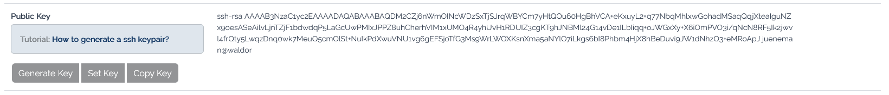

2. (optional) If you have already a personal ssh key-pair, you can also
upload your *public* key here instead of generating one.

## 1.3 Join the *ib2025workshop1* Project

If you have not done yet, please click on the following link to request
access to the project:

[ib2025workshop
invitation](https://simplevm.denbi.de/portal/webapp/#/workshops/invitation/faecbc35ec5648e890f6510f583e2b38)

The above invitation link will not work after October 2025.

If you have been invited to join a simpleVM project on de.NBI cloud via a link, you may now click on the link and follow the instructions to join the project. 

## 1.4 About the Tools and Prerequisites

In this workshop, we will use several tools that will be pre-installed
in your VM through conda environments:

-   **mash**: A fast genome and metagenome distance estimation tool
-   **parallel**: GNU parallel for running jobs in parallel
-   **fasterq-dump**: Part of the SRA Toolkit for converting SRA data

**Note**: These tools will be available after activating the conda environment
with `conda activate denbi` (covered later in this workshop).

**Note**: This workshop uses SimpleVM, which is a simplified interface
for the de.NBI Cloud. The full OpenStack Horizon interface has more advanced
features but is not required for this workshop.

## 1.5 Select your project

You start this tutorial from your profile page
(<https://simplevm.denbi.de>).

1.  Click on the `New Instance` tab.

2.  If you are already a member of a SimpleVM project then you are offered
    a drop down menu to select a project. In this case please select the
    **ib2025workshop1** project or your project. If this is your first SimpleVM project,
    you are now able to select/generate a key (next point) or directly
    start a VM.

3.  If you have no SSH key set so far, just click on generate key and
    save the private key. During this workshop you will not need this
    file because you will access all VMs via the browser. However, for
    your future work using SimpleVM, we highly recommend to read our
    de.NBI Cloud wiki regarding SSH keys:
    <https://cloud.denbi.de/wiki/portal/user_information/#ssh-key>

## 1.6 Start a VM

1.  Choose a name for your VM.

2.  Select **de.NBI small**.

3.  In the image section, please click on the *Research Environments*
    tab and select the **Guacamole** image based on **Ubuntu 24.04**.
    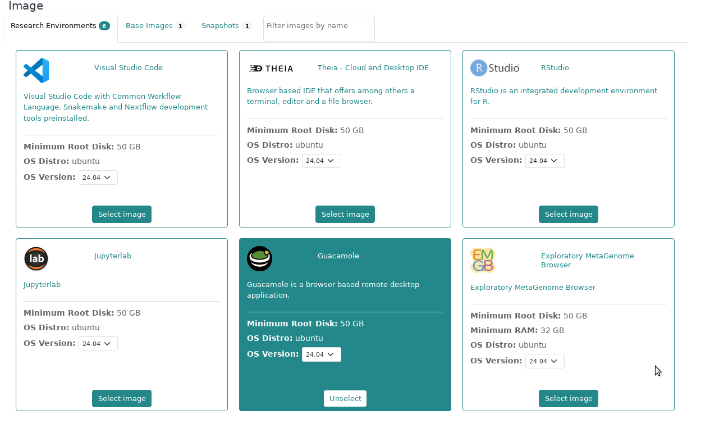

4.  Select the Conda tab and choose the following tools with their
    version numbers given below for installation via Conda:

    -   parallel (20220922)
    -   sra-tools (3.1.1)
    -   mash (2.2)
        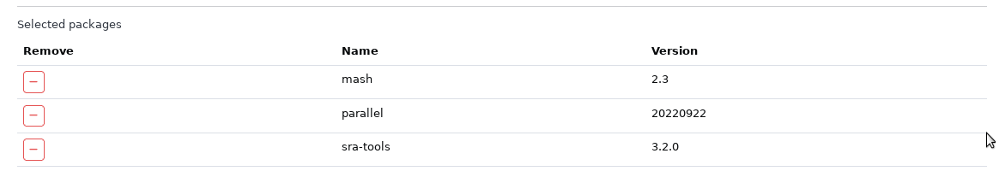

    You will learn in the next sections how to apply these tools.

5.  Grant access to the workshop organizers (**Sebastian Jünemann** and **Abhijeet Shah**), or your collaborators. This
    way these members get ssh access to your VM and can help you in case
    something does not work as expected.
    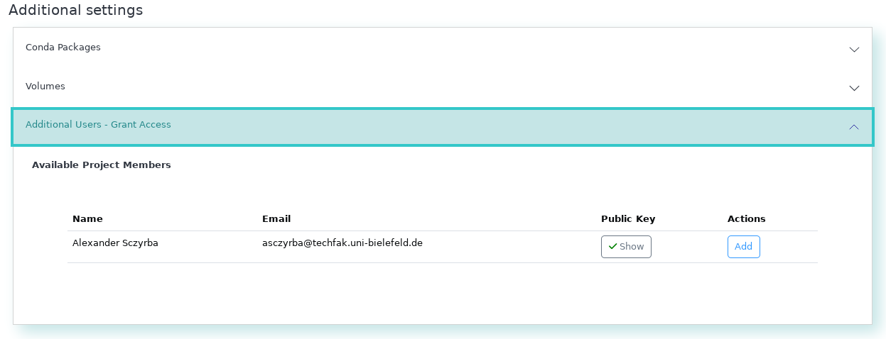

6.  Optional: Modify the URL path for Guacamole. You will access this VM
    via this URL. 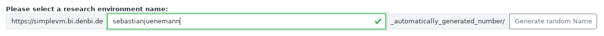

7.  Confirm the checkboxes and click on Start.

**Please note**: It may take up to 10 minutes or more to spawn an
instance and finish running the initial playbook to install and set up all
the software we will require.

# Section 2: Verify your VM properties and tools

After the start of the machine has been triggered, some time may pass
before the machine is available. As soon as this is the case, this
becomes visible via a green icon.

Once the VM is available, you can use it for testing the tools and
inspecting the data before you start with your analysis in the next
section.

## 2.1 Check your VM

Log in to the VM and verify that SimpleVM provisioned the VM correctly.

1.  After you have initiated the start-up of the machine, you should
    have been automatically redirected to the **Instance Overview**
    page. Now click on the dropdown of your machine. Click on the
    Guacamole URL which opens a new browser tab.
    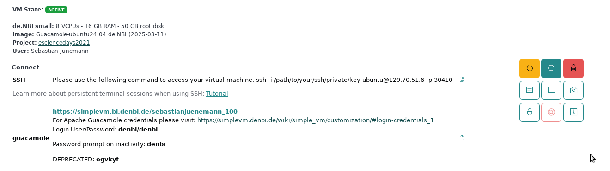

2.  Log into the virtual desktop environment using the credentials:
    `denbi` `denbi` 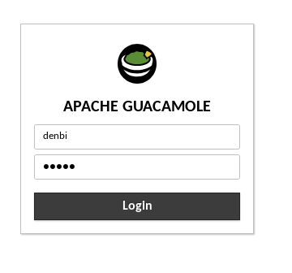

    And choose the correct keyboard layout for you.

3.  Right click on background and select `Open Terminal Here`.
    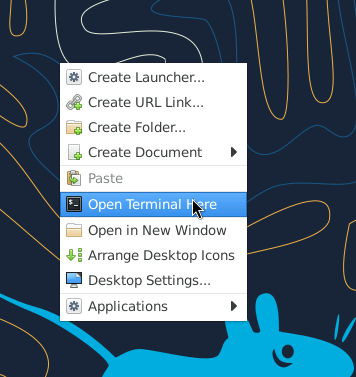

4.  Inspect the VM before starting to work with it. Let's check whether
    the VM has the properties that SimpleVM promised you by typing the
    following commands in your newly opened terminal window. `nproc`
    tells you the number of processing units.

    ``` bash
    nproc
    ```

    Does that correspond to the actual number of cores of the flavor you
    selected? `free -h` tells you the amount of RAM that is available to
    your VM. You will see that the sum of the total amount of Mem
    (`total` column, `Mem` row) corresponds roughly to the RAM size of
    your selected flavor.

    ``` bash
    free -h
    ```

    You can also check what kind of processes are running on your VM by
    executing `top` or `htop`.

    ``` bash
    htop
    ```

    Exit `htop` by typing `q` or `F10`.

5.  We have installed some tools previously using the conda environment management. In order to use them, we need to activate this environment. The default
    environment for using SimpleVM is **denbi**. To activate this, type

    `conda activate denbi`.

6.  Test if the needed commands are installed by running all of them
    with -h parameter. You will get an explanation of their usage in the
    next chapter.

    -   `mash -h`
    -   `parallel -h`

    If there is an error reported, then something went wrong, and we
    have to either repeat the conda installation manually or install it
    a different way.

7.  Remember that you have root permissions on the VM. You can install
    any tool that you need for your research. Let's test this statement
    by first fetching the latest information about available packages
    and installing the following commands (`fortune-mod`, `cowsay`) via
    `sudo`.

    Update:

    ``` bash
    sudo apt update
    ```

    Install the commands:

    ``` bash
    sudo apt install -y fortune-mod cowsay
    ```

    You can run both commands via

    ``` bash
    /usr/games/fortune | /usr/games/cowsay 
    ```

    Install the command-line client for OpenStack

    ``` bash
    sudo apt install python3-openstackclient
    ```

# Section 3: Using Horizon OpenStack Interface

We will now use your newly created SimpleVM as a replacement of any
given local compute infrastructure you might be working on in your
institute (or just for your laptop). Our goal is to transfer data from
your site (that is actually the SimpleVM) to your project in the de.NBI
Cloud. For that, we also initialize a second instance in the cloud using
the openstack interface.

## 3.1 Opening Horizon

1.  Go to [de.NBI Horizon (at
    Bielefeld)](https://openstack.cebitec.uni-bielefeld.de/project/)

## 3.2 Create a new Key Pair

2.  Click on the `Key Pairs` entry under the `Compute` menu and select
    `Create Key Pair`

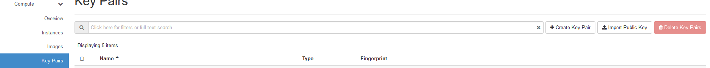

3.  Enter any name and select `SSH Key` as the Key Type.

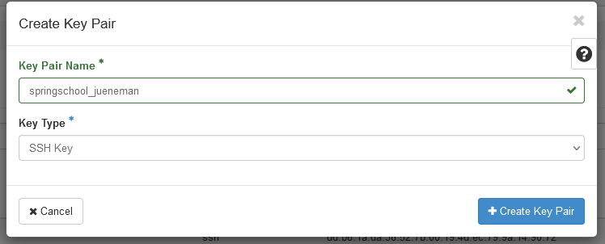

4.  The private key will be downloaded automatically to your SimpleVM
    instance. This instance can be accessed only by you, however,
    private keys should always have restricted access, which is
    currently not the case. We will change this now:

``` bash
mv ~/Downloads/*.pem ~/.ssh
chmod 600 ~/.ssh/*.pem
```

## 3.3 Start a new instance

We will now go together through the process of creating a new instance
using the more powerful yet also more complex interface as provided by
openstack horizon.

1.  Under the `Compute` menu, select the `Instances` entry and click on
    `Launch Instance`.

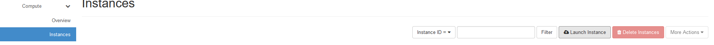

2.  In the first section, you just need to provide an instance name.
    Please choose your name so that we can identify your VM.

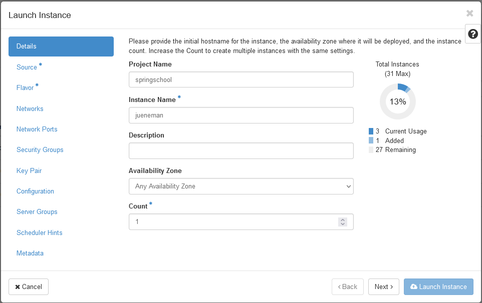

3.  Then, we need to select a bootable image. In the drop down menu
    `Select Boot Source` select the entry `Instance Snapshot` upon which
    the image `RDM Meets Cloud Workshop` will appear in the list below.
    Click the right up-arrow on that image so that it will be selected.

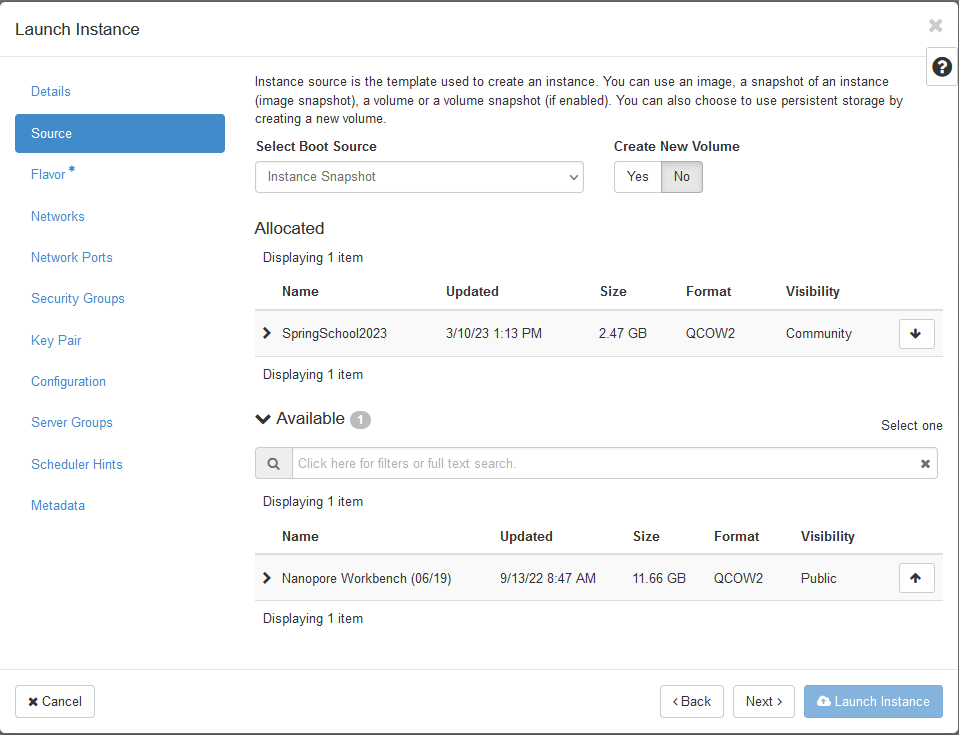

4.  Next the flavor, i.e. physical virtualization, needs to be chosen.
    Here, select the `de.NBI default` flavor.

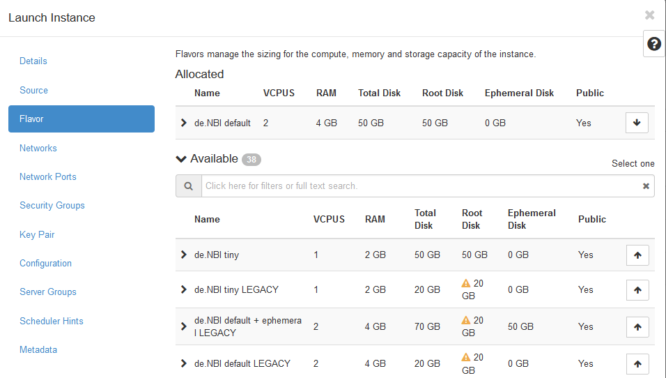

5.  The last option that needs to be selected is the key pair that will
    be used for the ssh connection. Select the `Key Pair` menu entry and
    choose the key pair that you just created in the previous section
    3.2.

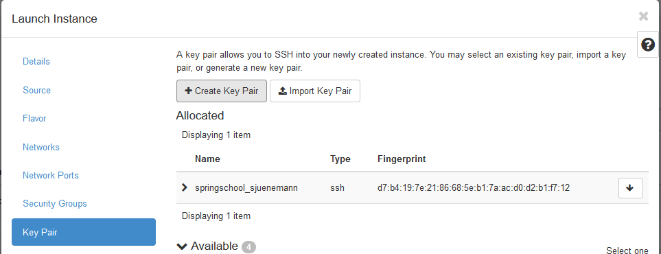

6.  You can now `Launch the Instance`.

## 3.4 Login to your instance using SSH

1.  Locate your running instance in the List of instances and note
    (write down) the last part of the IP address.

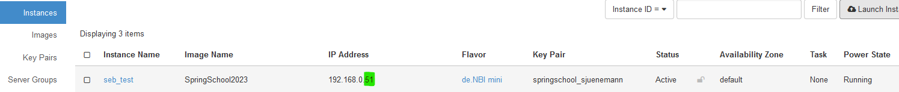

Add 30000 to this number (in this example this would be the number
30051). This will be the port that you will be using for the ssh
connection.

2.  In the guacamole environment open a terminal (or use any running
    terminal session) and type the following command:

``` bash
ssh -i ~/.ssh/*.pem ubuntu@129.70.51.199 -p YOUR_PORT
```

**Note:** You need to replace YOUR_PORT with the actual port number you
got in the step above!

If everything went without any issue, you should see the following
prompt:

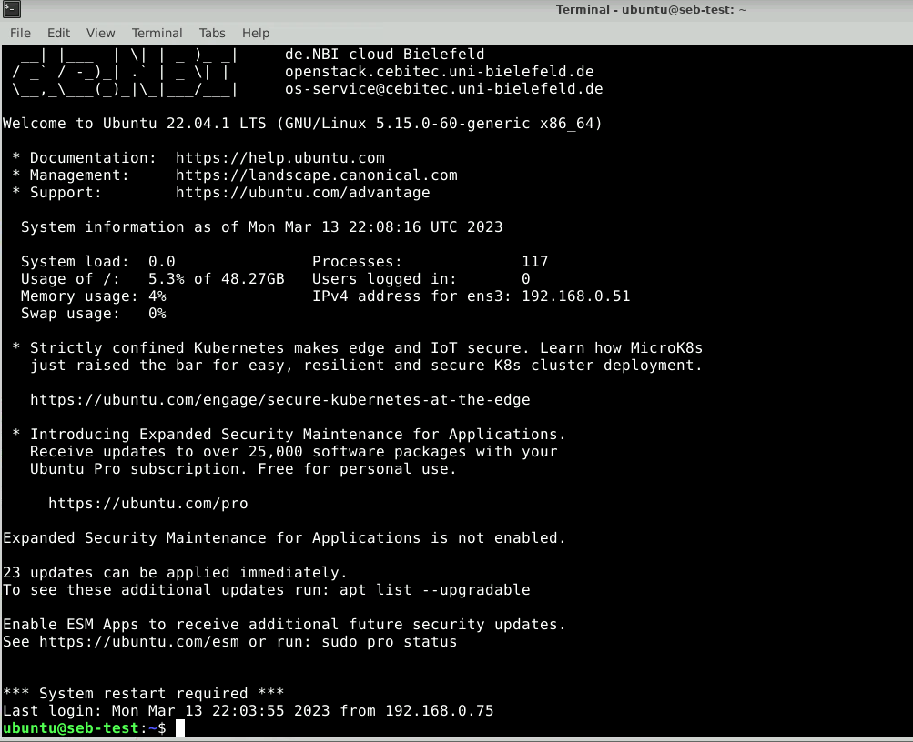

Here, we will create a new folder called `data_remote`:

``` bash
mkdir ~/data_remote
```

# Section 4: Using the Object Storage

In this section, we will use the openstack horizon interface directly.
Please navigate to the following site:

<https://openstack.cebitec.uni-bielefeld.de/project/>

## 4.1 Creating application credentials

In this section you will create an [application
credential](https://access.redhat.com/documentation/zh-cn/red_hat_openstack_platform/14/html/users_and_identity_management_guide/application_credentials)
and download the autogenerated `clouds.yaml`. `clouds.yaml` contains all
required authentication information. Follow the images:


Don't use the input field secret. As you can see its input is not
hidden. OpenStack will generate a strong secret for you, if you leave it
blank. You should pick a sensible expiration date.


We will now save the downloaded `clouds.yaml` under
`~/.config/openstack/`. That will allow the `OpenstackClient` to access
it. You will also need the `app-cred-openrc.sh` script finish the setup.


If the file was auto downloaded, you need to move it instead:

``` bash
mkdir -p ~/.config/openstack
mv ~/Downloads/clouds.yaml ~/.config/openstack/
mv ~/Downloads/app-cred*.sh ~/.config/openstack/
chmod 600 ~/.config/openstack/clouds.yaml
chmod 600 ~/.config/openstack/app-cred*.sh
source ~/.config/openstack/app-cred*.sh
```

If you have `OpenstackClient` installed and `openstack subnet list` runs
without error, you are ready to proceed.

``` bash
openstack project list
openstack project show ib2025openstack1
```

## 4.2 Creating S3 credentials

The creation of credentials for the project related object storage can't
be done in the web interface. Therefore, we will use the openstack CLI
for that.

``` bash
openstack --os-identity-api-version 3 ec2 credentials create
```

This command will return you the newly generated key and secret. You
can, at any time, look up what S3 credentials are still valid for you
using

``` bash
openstack --os-identity-api-version 3 ec2 credentials list
```

We will now configure the S3 minio client:

``` bash
mc alias set ibworkshop https://openstack.cebitec.uni-bielefeld.de:8080/ <YOUR-ACCESS-KEY> <YOUR-SECRET-KEY>
```

## 4.3 Uploading data to the Object Storage

We will now use the minio client to upload some data. In the guacamole
SimpleVM instance, type:

``` bash
cd /mnt/volume
```

We will download some more data to play around with:

``` bash
mc cp sra/ftp.era.ebi.ac.uk/vol1/fastq/SRR398/008/SRR3984908/SRR3984908_1.fastq.gz .
mc cp sra/ftp.era.ebi.ac.uk/vol1/fastq/SRR398/008/SRR3984908/SRR3984908_2.fastq.gz .
```

Next, we are going to create a new object storage container, a so called
bucket. For this, we will use for the first time the horizon interface.
Navigate to the **Container** entry under the **Object Store** menu
entry. Note: All containers here are visible to all project members, as
those containers in openstack are bound to the project.

This container is empty, but we can show it nevertheless on the command
line using the minio client:

``` bash
mc ls ibworkshop
```

This should show you your previously created bucket (container) name
(next to all others). You can now upload data into it.

``` bash
mc cp *.fastq.gz ibworkshop/YOUR_CONTAINER_NAME
mc ls ibworkshop/YOUR_CONTAINER_NAME
```

Tip: You can enable auto completion for the minio client. After
activation, the shell needs to be restarted, though.

``` bash
mc --autocompletion
```

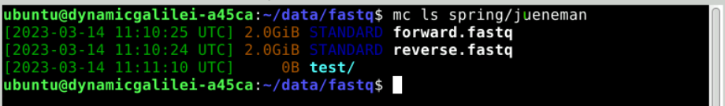

## 4.4 Additional Object Storage Operations

For more advanced work with the SRA mirror and metagenomic datasets
analysis, please refer to the [de.NBI Cloud SRA mirror documentation](https://cloud.denbi.de/wiki/).

Here are some additional useful object storage operations:

1.  **Copy data between buckets:**

    ``` bash
    touch YOUR_NAME.txt
    wget https://loremipsum.de/downloads/original.txt -O YOUR_NAME.txt
    mc cp YOUR_NAME.txt ibworkshop/YOUR_CONTAINER_NAME/
    mc cp ibworkshop/YOUR_CONTAINER_NAME/YOUR_NAME.txt ibworkshop/example/
    ```

2.  **Mirror large entire directories:**

    ``` bash
    mc cp --recursive aws/sra-pub-run-odp/sra/SRR28001828 ibworkshop/YOUR_CONTAINER_NAME/
    ```

3.  **Set public access for sharing data:**

    **Caution**: This will expose your data in the folder to the open internet, and cannot be undone.

    ``` bash
    mc anonymous --recursive set download ibworkshop/YOUR_CONTAINER_NAME/public/
    ```

# Section 5: Advanced Data Transfer Methods

This section covers examples of advanced data transfer techniques for
moving data efficiently between cloud instances, object storage
containers, and hybrid environments. These methods are particularly
useful for large-scale data processing workflows and collaborative
research projects. **However** these examples do not work out of the
box. You will need to modify sufficiently.

## 5.1 Advanced Object Storage Operations

### 5.1.1 Cross-region data replication

**Use Case**: You're collaborating with researchers at different de.NBI
sites (Bielefeld, Heidelberg, Geissen, Berlin, etc.) and need to share
large metagenomic datasets. Cross-region replication ensures data
availability and reduces transfer times.

**How it works**: Data is automatically synchronized between different
de.NBI cloud regions, providing redundancy and faster access for
collaborators. This requires access to projects located at multiple sites. 

Advantages:

-   **Disaster recovery**: If one region is unavailable, data remains
    accessible

-   **Collaboration**: Multiple teams can work on the same datasets
    simultaneously

``` bash
# Configure multiple regions (for example)
mc alias set UniBi https://openstack.cebitec.uni-bielefeld.de:8080/ <ACCESS-KEY> <SECRET-KEY>
mc alias set UniHe https://denbi-cloud.bioquant.uni-heidelberg.de:8080/ <ACCESS-KEY> <SECRET-KEY>

# Replicate data between regions
mc mirror ibworkshop/YOUR_CONTAINER_NAME UniHe/BACKUP_CONTAINER/
```

### 5.1.2 Batch operations with minio client

**Use Case**: You have hundreds of sequencing files from different
experiments that need to be organized and uploaded to object storage.
Manual upload would take hours and be error-prone.

**How it works**: Minio client can process multiple files simultaneously
using wildcards and patterns, with built-in progress monitoring and
error handling.

**Advantages:**

-   **Time savings**: Upload hundreds of files in one command instead of
    individual uploads

-   **Error reduction**: Automated pattern matching reduces human errors

-   **Progress tracking**: Monitor large transfers with real-time
    progress bars

``` bash
# Upload multiple file types with wildcards
mc cp /mount/volume/*.{fastq,fna,fa} ibworkshop/YOUR_CONTAINER_NAME/raw_data/

# Download files matching specific patterns
mc find ibworkshop/YOUR_CONTAINER_NAME --name "*.fastq.gz" --exec "mc cp {} ~/downloads/"
```

## 5.2 Advanced SSH-based Transfers

### 5.2.1 Using rsync for efficient transfers

**Use Case**: You're regularly updating large datasets (like reference
genomes or annotation files) or need to make regular daily or weekly
backups.

**How it works**: Rsync compares file timestamps and sizes, transferring
only the differences between source and destination. This is especially
efficient for incremental backups and dataset updates.

**Advantages**:

-   **Time efficiency**: Updates take minutes instead of hours for large
    datasets

-   **Resume capability**: Interrupted transfers can be resumed from
    where they left off

-   **Compression**: Built-in compression reduces transfer size and time

``` bash
# Sync directories between instances
rsync -avz -e "ssh -p YOUR_PORT" ubuntu@YOUR_VM_IP:/mnt/volume/data/  ubuntu@YOUR_OTHER_VM_IP:/PATH/TO/data

# Transfer with compression and progress
rsync -avzP -e "ssh -p YOUR_PORT" ~/large_dataset/ ubuntu@YOUR_VM_IP:/mnt/volume/

# Exclude certain file types.
rsync -avz --exclude="*.tmp" --exclude="*.log" -e "ssh -p YOUR_PORT" ~/data/ ubuntu@YOUR_VM_IP:/mnt/volume/
```

### 5.2.2 Parallel transfers with GNU parallel

**Use Case**: You have thousands of sequencing files that need to be
transferred to the cloud, and sequential transfer would take days.

**How it works**: GNU parallel manages multiple transfer processes
simultaneously, utilizing available bandwidth and CPU cores efficiently.

**Advantages**:

-   **Speed**: Transfer multiple files simultaneously, utilizing more
    resources, and improving transfer throughput.

-   **Monitoring**: Track progress of all transfers simultaneously

``` bash
# Create a list of files to transfer
find ~/data -name "*.fastq" > files_to_transfer.txt

# Transfer files in parallel (4 at a time)
parallel -j 4 -a files_to_transfer.txt scp -i ~/.ssh/*.pem -P YOUR_PORT {} ubuntu@YOUR_VM_IP:/mnt/volume/
```

**However**: It must be noted that doing this puts considerable load on the network interface and network.

## 5.3 Transfer speed optimization

**Use Case**: You're transferring terabytes of sequencing data and need
to maximize transfer speeds to meet project deadlines or minimize cloud
costs.

**How it works**: Various techniques can be combined to optimize
transfer performance, including parallel connections, compression, and
optimized encryption.

**Advantages**:

-   **Time savings**: Reduce transfer times by 50-80% through
    optimization

-   **Cost reduction**: Faster transfers mean less VM time and lower
    costs

-   **Bandwidth utilization**: Make full use of available network
    capacity

-   **Scalability**: Techniques work for datasets of any size

``` bash
# Use multiple connections for faster transfers
mc cp --max-workers 8 aws/sra-pub-run-odp/sra/SRR34093683/SRR34093683  ibworkshop/YOUR_CONTAINER_NAME/

# Compress data during transfer
rsync -avz --compress-level=9 -e "ssh -p YOUR_PORT" ~/data/ ubuntu@YOUR_VM_IP:/mnt/volume/
```
